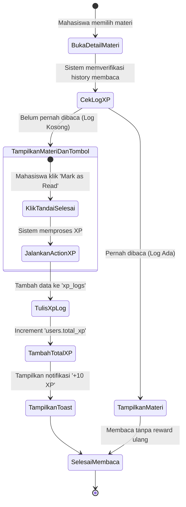
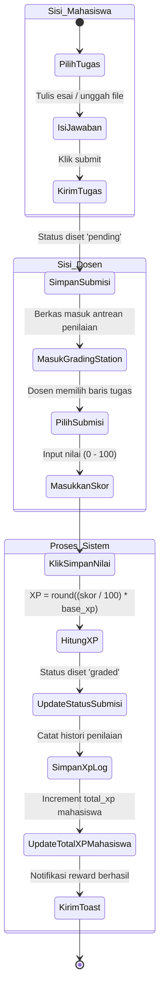

# Academic Design Diagrams (Dokumentasi Skripsi)

Dokumen ini menyediakan diagram pemodelan sistem (**Use Case Diagram** dan **Activity Diagram**) yang dirancang khusus untuk kebutuhan dokumentasi akademis (skripsi). Diagram ditulis menggunakan format **Mermaid** agar mudah disalin langsung ke dalam draf laporan skripsi.

---

## 1. Use Case Diagram

Diagram Use Case menggambarkan interaksi antara dua Aktor utama (**Mahasiswa** dan **Dosen/Admin**) dengan fitur-fitur di dalam sistem **FLC UMJ Gamified LMS**.

```mermaid
flowchart LR
    subgraph Aktor
        M[Mahasiswa / Member]
        D[Dosen / Admin]
    end

    subgraph Batasan Sistem [FLC UMJ Gamified LMS]
        uc_login(((Registrasi & Login)))
        uc_dash(((Mengakses Dashboard Gamifikasi)))
        uc_read(((Membaca Materi Kuliah)))
        uc_submit(((Mengirimkan Tugas)))
        uc_leader(((Melihat Peringkat / Hall of Fame)))
        
        uc_m_mat(((Mengelola Materi CRUD)))
        uc_m_task(((Mengelola Tugas CRUD)))
        uc_grade(((Menilai Tugas / Grading Station)))
    end

    %% Relasi Mahasiswa
    M --> uc_login
    M --> uc_dash
    M --> uc_read
    M --> uc_submit
    M --> uc_leader

    %% Relasi Dosen
    D --> uc_login
    D --> uc_m_mat
    D --> uc_m_task
    D --> uc_grade
    D --> uc_leader

    %% Hubungan Use Case Internal
    uc_grade -.->|includes| uc_dash : "Update XP & Level"
    uc_read -.->|includes| uc_dash : "Update XP & Badge"
    uc_submit -.->|includes| uc_grade : "Kirim berkas ke Antrean"
```

### Deskripsi Use Case
1. **Registrasi & Login:** Gerbang utama akses sistem untuk Mahasiswa maupun Dosen.
2. **Mengakses Dashboard Gamifikasi:** Mahasiswa dapat melihat akumulasi poin (XP), grafik perkembangan Level, dan daftar lencana (Badge) yang telah diraih.
3. **Membaca Materi Kuliah:** Mahasiswa mengakses materi berupa teks, video, atau tautan. Sistem mendeteksi aktivitas membaca pertama kali dan memberikan reward XP.
4. **Mengirimkan Tugas:** Mahasiswa mengunggah berkas (`zip`/`pdf`) atau menulis jawaban esai sebelum batas tenggat waktu.
5. **Melihat Peringkat (Hall of Fame):** Halaman publik untuk memantau papan skor (Leaderboard) mahasiswa teraktif berdasarkan total XP.
6. **Mengelola Materi & Tugas (CRUD):** Dosen dapat menambah, mengubah, atau menghapus berkas materi pembelajaran dan katalog tugas.
7. **Menilai Tugas (Grading Station):** Halaman antrean dosen untuk mengevaluasi jawaban mahasiswa, memberikan skor (0-100), dan secara otomatis mengkalkulasi distribusi XP secara proporsional.

---

## 2. Activity Diagram: Pembelajaran Mandiri (Membaca Materi)

Diagram aktivitas ini menggambarkan alur kerja sistem saat Mahasiswa mengakses materi pembelajaran untuk mendapatkan Experience Points (XP) secara otomatis.



---

## 3. Activity Diagram: Pengiriman & Penilaian Tugas

Diagram aktivitas ini menggambarkan alur dari saat Mahasiswa mengirimkan tugas hingga Dosen menilai tugas tersebut dan mendistribusikan reward XP.



---

## 4. Konteks Akademik untuk Bab III / Bab IV Skripsi

* **Metode PBL (Points, Badges, Leaderboards):**
  * **Points (XP):** Diimplementasikan pada database `users.total_xp` dan audit trail `xp_logs`. Ditunjukkan dalam Activity Diagram Pembelajaran Mandiri (reward statis `10 XP`) dan Penilaian Tugas (reward dinamis proporsional).
  * **Badges:** Disiapkan lewat relasi Many-to-Many tabel `user_badges` dan `badges` (memerlukan pengembangan logic trigger lebih lanjut).
  * **Leaderboards:** Ditunjukkan pada use case *Melihat Peringkat / Hall of Fame* yang membatasi query hanya pada level database untuk meminimalkan beban CPU server.
* **Keamanan Unggah Berkas (Bab Evaluasi Sistem):**
  * Temuan kerentanan *Unrestricted File Upload* (RCE) pada Bab Evaluasi Keamanan dapat dijelaskan dengan alur pengunggahan tugas di mana sistem harus membatasi tipe ekstensi berkas demi mencegah eksekusi skrip backdoor oleh mahasiswa di direktori `/public`.
