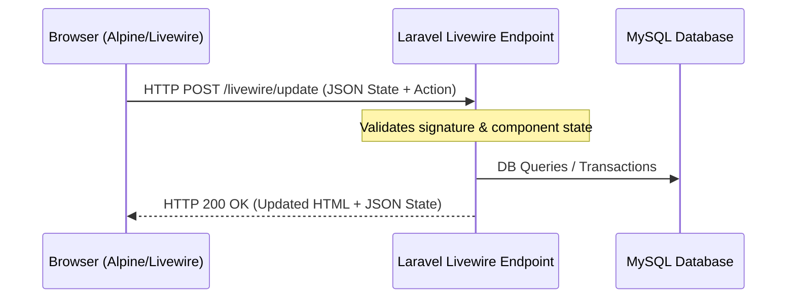

# API Design Review

## Current API Architecture



### Analysis of the Current State
Currently, the application **does not have a dedicated public REST or GraphQL API layer**. All client-server communications are orchestrated by **Laravel Livewire's internal transport mechanism** via `/livewire/update` POST requests. 

* **How it works:** Livewire serializes component properties, signs them cryptographically to prevent tampering, sends them via AJAX, processes the actions on the server, and returns updated HTML differentials (patches) alongside state updates.
* **Limitations:**
  1. **Not integratable:** Third-party applications (like UMJ's main university student portal SIAKAD) cannot easily communicate with the LMS or pull grade/XP statistics.
  2. **Mobile App Blocker:** Building native mobile applications (iOS/Android) is difficult since there is no structured API endpoint to fetch materials or submit tasks.
  3. **High Coupling:** The user interface is tightly coupled with server-side components.

---

## Proposed Enterprise API Design & Standards

To achieve enterprise readiness, the application must implement a standardized, versioned REST API.

### 1. Versioning Strategy
Implement URL-based versioning to ensure backward compatibility as features evolve.
* **Format:** `/api/v1/{resource}`
* *Example:* `GET /api/v1/leaderboard`

### 2. Standardized Endpoint Structure

| Method | Endpoint | Description | Auth Required |
| --- | --- | --- | --- |
| **GET** | `/api/v1/materials` | Retrieve list of learning materials (paginated). | Yes |
| **GET** | `/api/v1/materials/{id}` | Fetch a specific material detail and mark as read. | Yes |
| **GET** | `/api/v1/tasks` | Retrieve active tasks and deadlines. | Yes |
| **POST** | `/api/v1/tasks/{id}/submissions` | Submit essay or upload file for a task. | Yes |
| **GET** | `/api/v1/leaderboard` | Get top student ranks (supports `page` and `limit`). | Yes |
| **GET** | `/api/v1/profile` | Get current user's level, XP logs, and badges. | Yes |

---

### 3. Standardized Response & Error Structure
All API responses must return a consistent JSON payload wrapper.

#### Success Response Example (`200 OK`)
```json
{
  "success": true,
  "data": {
    "id": 1,
    "title": "Arsitektur Laravel 12 & Livewire 3",
    "type": "video",
    "xp_reward": 50,
    "file_url": "https://www.youtube.com/watch?v=laravel12-livewire3"
  },
  "message": "Material retrieved successfully.",
  "meta": null
}
```

#### Paginated Response Example (`200 OK`)
```json
{
  "success": true,
  "data": [
    { "id": 1, "name": "Mahasiswa Berprestasi", "total_xp": 2500, "rank": 1 }
  ],
  "message": "Leaderboard retrieved successfully.",
  "meta": {
    "current_page": 1,
    "last_page": 5,
    "per_page": 10,
    "total": 50
  }
}
```

#### Error Response Example (`422 Unprocessable Entity`)
```json
{
  "success": false,
  "data": null,
  "message": "Validation failed.",
  "errors": {
    "uploadedFile": [
      "The uploaded file must not exceed 2 MB."
    ]
  }
}
```

---

### 4. API Security Recommendations
* **Authentication:** Use **Laravel Sanctum** for lightweight API token authentication (suitable for SPAs and mobile apps) or **Laravel Passport** if OAuth2 scopes are required for third-party clients.
* **Rate Limiting:** Enforce strict API throttle limits using Laravel's rate limiting middleware:
  ```php
  Route::middleware('throttle:api')->group(function () {
      Route::get('/leaderboard', [LeaderboardController::class, 'index']);
  });
  ```
  * *Standard Limit:* 60 requests per minute per IP/Token.

### 5. Documentation
Use **Swagger/OpenAPI 3.0** via the `darkaonline/l5-swagger` package. Annotate API controllers in PHP to auto-generate interactive documentation at `/api/documentation`, making onboarding for external developers seamless.
