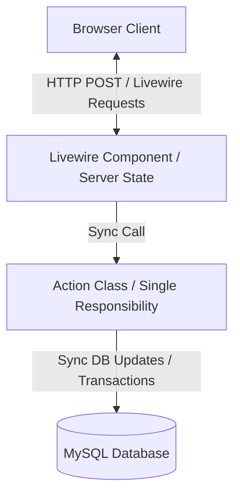
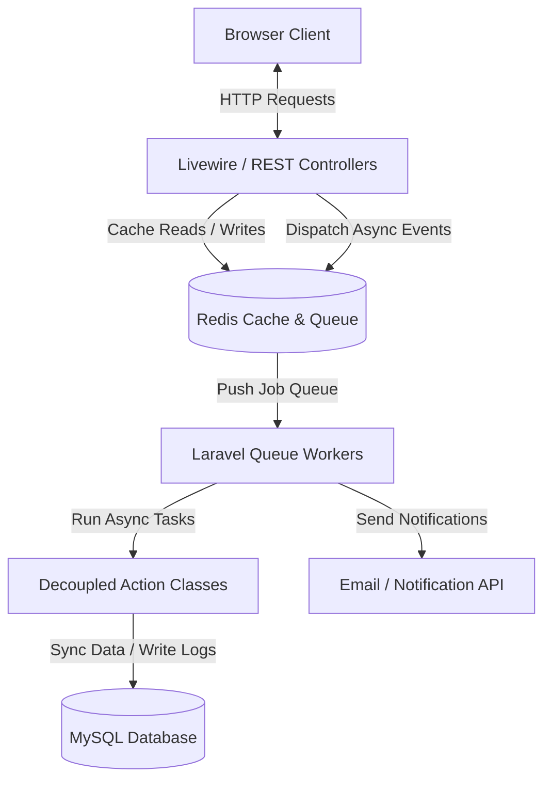

# Software Architecture Review

## Current Architecture Diagram



---

## Recommended Architecture Diagram



---

## Architectural Analysis

### 1. Architectural Patterns & Layering
* **MVC & TALL Stack:** The project utilizes the Model-View-Controller (MVC) pattern adapted for the TALL stack. Livewire components act as functional controllers that maintain component-level state and render Blade views dynamically.
* **Single Responsibility Action Pattern:** Instead of bloated controllers or models, business operations are extracted into dedicated Action classes under `App\Actions`.
  * **Evidence:** [AwardMaterialXpAction.php](file:///d:/LMS%20FLC/flc-lms/app/Actions/Gamification/AwardMaterialXpAction.php), [SubmitTaskAction.php](file:///d:/LMS%20FLC/flc-lms/app/Actions/LMS/SubmitTaskAction.php), and [GradeSubmissionAction.php](file:///d:/LMS%20FLC/flc-lms/app/Actions/LMS/GradeSubmissionAction.php).
* **Missing Repository Layer:** The codebase queries Eloquent models directly. While acceptable for a small application, this tightly couples the database layout with the application layers.
* **Lack of DDD Readiness:** Models, actions, and views are mixed. There is no domain-driven design structure. If the business grows, it will be hard to isolate core domains like "Course Catalog" from "Gamification Mechanics".

---

## Strengths & Weaknesses

### Strengths
1. **Thin Livewire Components:** Livewire components remain extremely clean. For example, [MaterialShow.php](file:///d:/LMS%20FLC/flc-lms/app/Livewire/MaterialShow.php) delegating marked-as-read operations completely to `AwardMaterialXpAction` keeps components light.
2. **Encapsulated Transactions:** Critical actions like XP increments and database insertions are encapsulated inside ACID database transactions (`DB::transaction`). This ensures data consistency on write failures.
3. **Stateless UI Design:** In student-facing components (e.g. `GamifiedDashboard` and `HallOfFame`), data is computed inside `render()` and passed directly to the view instead of keeping large models in public state properties. This prevents stale Livewire component states.

### Weaknesses
1. **Lack of Event Decoupling (Gamification Rule Violation):**
   * **Evidence:** [architecture-context.md:L21-25](file:///d:/LMS%20FLC/flc-lms/architecture-context.md#L21-25) explicitly states: *"The Gamification logic MUST be completely decoupled... Dispatch an Event... Create Listeners to handle the Event in the background."*
   * **Violation:** In reality, the codebase runs gamification updates synchronously in the HTTP request thread. For example, [MaterialShow.php:L56-67](file:///d:/LMS%20FLC/flc-lms/app/Livewire/MaterialShow.php#L56-67) calls `AwardMaterialXpAction::execute` synchronously. There are no Events or Listeners.
2. **Synchronous Writes:** XP logic, database increments, and logging occur synchronously during student and admin interactions. If database queries slow down under high load, it blocks page responsiveness.
3. **No Caching:** The Leaderboard page ([HallOfFame.php](file:///d:/LMS%20FLC/flc-lms/app/Livewire/HallOfFame.php)) queries MySQL database tables on every page load. If 100 students reload the leaderboard simultaneously, the server runs multiple `COUNT` and `ORDER BY` scans over the `users` table.

---

## Risks & Bottlenecks
* **Lost Update Race Conditions:** Although incrementing XP is atomic (`$user->increment('total_xp')`), checking if a user has already read a material is checked via:
  ```php
  $alreadyClaimed = XpLog::where(...)->exists();
  ```
  If a student double-clicks a link or makes concurrent requests within milliseconds, both requests can pass the `exists()` check, leading to duplicate XP logs.
* **N+1 Queries on Leaderboard User Levels:** The Hall of Fame view iterates over the top 50 users and accesses their current level. Since there is no eager-loading for the level relationship, it performs a separate database query for each row, resulting in 50 queries for one request.

---

## Recommendations
1. **Implement Real Events & Listeners:** Refactor actions to dispatch events, and process gamification rules asynchronously.
   * *Example:*
     ```php
     event(new MaterialRead($user, $material));
     ```
2. **Setup Background Queue Workers:** Register Laravel Queue Workers (backed by Redis) to consume events in the background, keeping web requests fast.
3. **Leverage Redis Sorted Sets for Leaderboard:** Use Redis `ZADD` to set student scores (XP) and `ZREVRANGE` to fetch top rankings in $O(\log N + M)$ time complexity, bypassing MySQL queries entirely.
4. **Synchronize Level ID Cache:** Implement a listener that checks if total XP crosses level boundaries and updates `users.level_id` accordingly, caching the Level relationship on user session.
