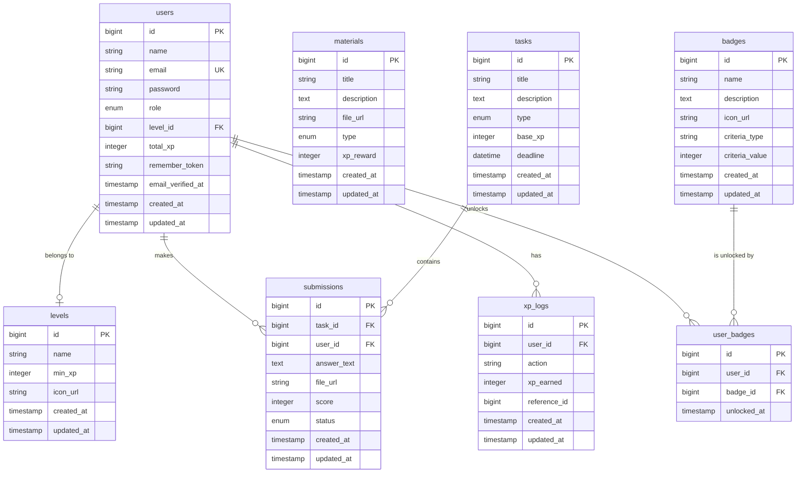

# Database Design Review

## Entity-Relationship Diagram (ERD)



---

## Database Design Analysis

### 1. Data Modeling & Normalization
* **Core Design:** The database is designed up to the Third Normal Form (3NF). Entities are separated clearly (e.g., Users, Submissions, Materials, Tasks).
* **Gamification Decoupling:** Gamification elements are stored in separate tables (`levels`, `badges`, `user_badges`, `xp_logs`), representing a clean relational model.
* **Denormalization Risk:** The `users.total_xp` column acts as a denormalized running total of a student's XP. While beneficial for performance (avoiding `SUM()` queries over `xp_logs` every time a dashboard or leaderboard is rendered), it introduces data consistency risks if an update fails or if an administrator deletes logs without updating `users.total_xp`.

### 2. Table Design & Performance Audit

#### Findings: Missing Indices on Query Paths
* **Evidence:** [AwardMaterialXpAction.php:L35-39](file:///d:/LMS%20FLC/flc-lms/app/Actions/Gamification/AwardMaterialXpAction.php#L35-39)
  ```php
  $alreadyClaimed = XpLog::query()
      ->where('user_id',      $user->id)
      ->where('action',       self::ACTION)
      ->where('reference_id', $material->id)
      ->exists();
  ```
* **Impact:** In the migration [2026_04_12_002807_create_xp_logs_table.php](file:///d:/LMS%20FLC/flc-lms/database/migrations/2026_04_12_002807_create_xp_logs_table.php), there is only a single index on `user_id`. There is no composite index on `(user_id, action, reference_id)`. When the application grows to hundreds of thousands of XP transactions, this check will perform a slow, unindexed scan over MySQL pages, leading to performance bottlenecks during high-concurrency learning sessions.
* **Severity:** **Medium**
* **Recommendation:** Create a composite index in a new migration:
  ```php
  Schema::table('xp_logs', function (Blueprint $table) {
      $table->index(['user_id', 'action', 'reference_id']);
  });
  ```

#### Cascade Deletes on Core Data
* **Evidence:** [2026_04_12_002845_create_submissions_table.php](file:///d:/LMS%20FLC/flc-lms/database/migrations/2026_04_12_002845_create_submissions_table.php)
  ```php
  $table->foreignId('task_id')->constrained()->cascadeOnDelete();
  $table->foreignId('user_id')->constrained()->cascadeOnDelete();
  ```
* **Impact:** Cascade delete on `user_id` or `task_id` for submissions means that if a user or task is deleted, their submissions are silently and permanently wiped. For audit trails and compliance in educational software, cascade delete is dangerous.
* **Severity:** **Low-Medium**
* **Recommendation:** Use soft deletes (`SoftDeletes`) on users, tasks, and submissions, or restrict deletions on foreign keys (`restrictOnDelete()`) and require soft-delete cleanups.

### 3. Data Integrity & Constraints
* **Signed XP Logs:** In `xp_logs`, the `xp_earned` is marked as a signed integer, allowing negative numbers for penalties. This is a solid design choice for gamified rules.
* **Lack of Uniqueness Constraints on Submissions:** The system guards submission count at the application layer ([SubmitTaskAction.php:L35-38](file:///d:/LMS%20FLC/flc-lms/app/Actions/LMS/SubmitTaskAction.php#L35-38)). However, at the database layer, there is no unique constraint on `(user_id, task_id)` in the `submissions` table. Under high concurrency, a student double-clicking the submit button can bypass the application-layer check and create duplicate submission rows.
* **Severity:** **Medium**
* **Recommendation:** Add a unique composite index to `submissions` table in a new migration:
  ```php
  $table->unique(['user_id', 'task_id']);
  ```

### 4. Scalability & Partitioning Opportunity
* **Large Tables:** The `xp_logs` table is append-only and grows rapidly. With 10,000 active students doing multiple tasks and reading materials, it will quickly exceed millions of rows.
* **Partitioning Plan:** Partition the `xp_logs` table by range of `created_at` yearly/monthly, or move historic logs older than 6 months to an archival cold storage (or database table `xp_logs_archive`) to keep query times for active student dashboard feeds fast.
