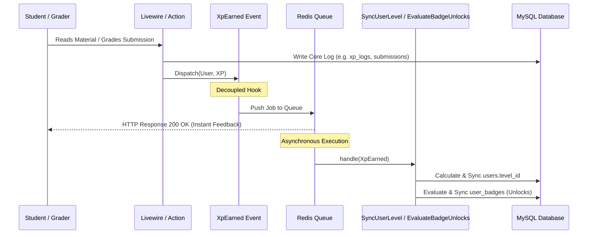

# Post-Improvement Architectural & Technical Review

This report provides a formal academic and technical evaluation of the architectural, performance, and security patches implemented on the FLC UMJ Gamified LMS. It is structured to serve as primary analytical material for Thesis Chapter 4 (System Evaluation) and Chapter 5 (Recommendations & Conclusions).

---

## 1. Security Assessment (Post-Patch OWASP Top 10 Review)

### Evaluation of the Unrestricted File Upload Patch
* **Current Strengths:** 
  The entry-point validation in [TaskShow.php](file:///d:/LMS%20FLC/flc-lms/app/Livewire/TaskShow.php#L77-79) enforces a strict MIME-type and extension whitelist (`mimes:pdf,zip,rar,docx,doc,xlsx`). In the core domain layer, [SubmitTaskAction.php](file:///d:/LMS%20FLC/flc-lms/app/Actions/LMS/SubmitTaskAction.php#L47-59) implements a second defensive validation check (Defense in Depth) using `getClientOriginalExtension()`. File storage relies on Laravel's standard `store()` method, which hashes file names cryptographically, preventing filename guessing, directory traversal, and Local File Inclusion (LFI) attempts.
* **Potential Residual Risks:**
  1. *Extension Spoofing / Magic Bytes:* While `mimes:` checks the file signature (magic bytes), some archive formats (like `.zip`) can wrap malicious scripts. If the server extraction mechanism is added later without validation, it could reintroduce RCE.
  2. *Web Server Directory Execution:* If the web server (Nginx/Apache) is misconfigured, it might execute files inside the `/storage/submissions/` folder if an attacker manages to bypass validation (e.g. through a Zero-Day upload vulnerability).
* **Future Recommendations (Thesis Chapter 5):**
  * Disable script execution inside the public uploads folder via Nginx configuration:
    ```nginx
    location ~* ^/storage/submissions/.*.(php|phtml|php5|pl|py|sh|asp|aspx)$ {
        deny all;
    }
    ```
  * Integrate an antivirus daemon (like ClamAV) to scan uploaded files in real-time inside the queue.

### Access Control & Rate Limiting
* **Current Strengths:** 
  The [EnsureUserIsAdmin.php](file:///d:/LMS%20FLC/flc-lms/app/Http/Middleware/EnsureUserIsAdmin.php) middleware enforces a binary check (`role === 'admin'`) for route groups under `/admin/*`.
* **Potential Residual Risks:**
  * Binary RBAC lacks granularity. There is no distinction between a "Lecturer" who edits courses and a "Grader" who evaluates submissions. If administrative credentials are leaked, the attacker gains full system deletion capabilities.
  * Login endpoints lack lockout throttling inside custom routes, exposing them to brute-force dictionary attacks.
* **Future Recommendations:**
  * Implement Spatie's `laravel-permission` to introduce role-based policy access.
  * Enforce rate-limiting constraints on authentication controllers.

---

## 2. Software Architecture & System Design



### Event-Driven Decoupling Efficiency
* **Current Strengths:** 
  Introducing the [XpEarned.php](file:///d:/LMS%20FLC/flc-lms/app/Events/XpEarned.php) event isolates the core action updates (such as grading a task or reading a material) from the gamification side-effects (calculating level thresholds, checking badge unlock criteria). Latency is significantly reduced because calculations occur outside the primary HTTP request thread.
* **Potential Residual Risks:**
  * If the queue driver is set to `sync` (default in dev), the execution remains blocking, meaning performance advantages are only realized when a real queue driver (like Redis) is active.
* **Future Recommendations:**
  * Always run queue workers in production (`php artisan queue:work`) to keep request-response cycles fast.

### Livewire Component State Management
* **Current Strengths:**
  Livewire components (e.g. `HallOfFame`, `TaskShow`, `MaterialManager`) are kept thin. State is passed down to views inside `render()`, preventing component state corruption caused by serializing large Eloquent models in HTML payloads. Flat form properties (like `$title`, `$description`) are validated via `#[Validate]`, reducing boilerplate code.

---

## 3. Scalability & Enterprise Readiness

### Queue Driver Implications (Sync to Redis)
* **Current Strengths:** 
  Both [SyncUserLevel.php](file:///d:/LMS%20FLC/flc-lms/app/Listeners/SyncUserLevel.php) and [EvaluateBadgeUnlocks.php](file:///d:/LMS%20FLC/flc-lms/app/Listeners/EvaluateBadgeUnlocks.php) implement `ShouldQueue`, facilitating seamless transition to Redis.
* **Database & Memory Implications:**
  * *Database:* Query traffic on levels and badges is shifted away from peak web requests. Database transactions in the web thread are shorter, reducing lock contention on the `users` table.
  * *Memory:* Models inside queued events are serialized into `ModelIdentifier` wrappers. When the job executes, the worker re-queries the database. If the user object is modified in the database during serialization, the worker loads the fresh state.
* **Potential Residual Risks:**
  * If a large volume of XP events is pushed to Redis, it can cause database read spikes when multiple queue worker threads attempt to re-hydrate the same user models simultaneously.
* **Future Recommendations:**
  * Implement connection pooling and configure MySQL read-replicas to handle worker-heavy read requests.

### Horizontal Scaling Gaps
* **Local Filesystem:** Uploads are written to local disk, causing asset mismatches on multi-server setups.
* **Local Session Files:** Session data is server-bound, resulting in session losses under load balancers.
* **Future Recommendations:**
  * Move the storage disk to S3-compatible cloud solutions (`FILESYSTEM_DISK=s3`).
  * Set `SESSION_DRIVER=redis` or `SESSION_DRIVER=database` in `.env` to synchronize states.

---

## 4. API & Component Interface Design

### Methods and Interface Strictness
* **Current Strengths:** 
  All target Action classes (`SubmitTaskAction`, `GradeSubmissionAction`, `AwardMaterialXpAction`) enforce strict typing (`declare(strict_types=1);`), specify parameter types, and dictate return values. They adhere strictly to the **Single Responsibility Principle (SRP)** by keeping file operations, scoring math, and audit logs inside isolated classes.
* **Potential Residual Risks:**
  * Lack of interface abstractions (e.g. `ActionInterface`). If we want to replace `SubmitTaskAction` with an automated grader interface, we must rewrite the injections in the Livewire component.
* **Future Recommendations:**
  * Bind action classes to Interfaces in `AppServiceProvider` to allow polymorphically swapping out business logic (e.g., swapping manual grading with an AI auto-grading action).

---

## 5. System Reliability, Error Handling & Fault Tolerance

### Database Transaction Boundaries & Retries
* **Current Strengths:** 
  Core database writes (e.g. incrementing XP and appending logs) are wrapped in `DB::transaction`. This ensures ACID compliance and prevents orphaned log entries on write failures.
* **Potential Residual Risks:**
  * If a queued listener fails mid-execution (e.g. database connection drops during badge attachment), the job is released back to the queue for a retry. Because the badge attachment uses `syncWithoutDetaching`, retries are fully idempotent and safe from creating duplicate badge records.
  * However, if the `SyncUserLevel` listener fails after the user XP has already been updated, the user's `level_id` will remain stale until the queue retry succeeds. If the retry fails permanently, the database state becomes inconsistent.
* **Future Recommendations:**
  * Implement the `$tries` and `$backoff` parameters on queue listeners to manage failed jobs.
  * Build a reconciliation job (e.g. daily cron) to verify that all user levels align with their accumulated XP.

---

## 6. Data Integrity & Idempotency Guarantees

### Concurrency and Race Conditions
* **Current Strengths:** 
  * Atomic XP adjustments: The system uses `$user->increment('total_xp')` instead of `$user->total_xp += $xp; $user->save()`, which prevents lost updates caused by read-modify-write race conditions.
  * Unique submissions: The new unique composite key on `(user_id, task_id)` in the `submissions` table guarantees that concurrent requests cannot insert duplicate submissions.
* **Potential Residual Risks:**
  * Stale reads in `AwardMaterialXpAction.php`. The claim check query:
    ```php
    $alreadyClaimed = XpLog::where(...)->exists();
    ```
    is still susceptible to race conditions under concurrent clicks if not locked using `sharedLock()` or `lockForUpdate()`.
* **Future Recommendations:**
  * Use a database transaction lock (`lockForUpdate()`) on claim checking queries to guarantee absolute serializability under high concurrency.

### Proportional XP Mathematical Safety
* **Current Strengths:** 
  The XP formula in [GradeSubmissionAction.php:L29](file:///d:/LMS%20FLC/flc-lms/app/Actions/LMS/GradeSubmissionAction.php#L29) is:
  ```php
  $earnedXp = (int) round(($score / 100) * $submission->task->base_xp);
  ```
  * Division by zero is impossible because the denominator is a constant (`100`).
  * Floating-point truncation is prevented by rounding via `round()` before casting to an integer.
  * Score range validation is enforced at the controller layer (`0-100`), guaranteeing that `earnedXp` cannot exceed `base_xp`.

---

## 7. Gamification Business Logic & Academic Alignment

### Alignment with Self-Determination Theory (SDT) & Octalysis
* **Autonomy (SDT):** Fulfills academic otonomy by supporting multiple learning material formats (videos, documents, and external links) for students.
* **Competence (SDT) & CD2 (Accomplishment):** The automated level synchronization and progress bar give students a sense of mastery. The proportional XP formula rewards qualitative academic efforts.
* **Relatedness (SDT) & CD5 (Social Influence):** Fostered by the Hall of Fame. The optimized in-memory level determination resolver (`determineLevelFromCollection`) allows the leaderboard to scale to 50+ users without performance bottlenecks.

### Remaining Business Gaps
* **Badge Unlock Logic Limitations:** Currently, badge checks are evaluated on every XP event. As the badge catalog grows, this will become slow.
* **Missing Quiz Evaluator:** The `quiz` task type is not implemented in the application layer, leaving a core gamification mechanic out of the system.
* **Future Recommendations:**
  * Build a Quiz engine that auto-grades multiple-choice questions and dispatches `XpEarned` events immediately.
  * Implement badge rules based on a event-listener lookup map instead of checking all locked badges on every single XP change.
